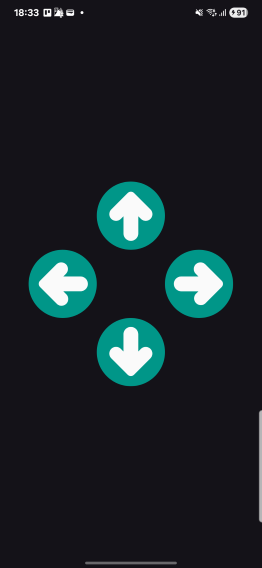
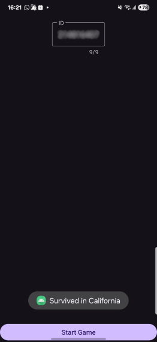

## HW2 - Android Security
Submitted By: [@lordYorden](https://github.com/lordYorden/)

## My reversing process:
1. I downloaded the apk from module and uploaded it into [APK Decompiler](http://www.javadecompilers.com/apk)
2. Got a zip file and extracted it.
3. Opened the zip in vscode and found the `source code`
4. Copied the activity and layout files into a `new android app project`
5. Copied the relevant `resources` from `values/strings.xml`
6. And run the app.
7. Got the same crush as before
8. Opened `Logcat` and saw the problem was in `Activity_Menu:47`
    ```java
     String data = Activity_Menu.getJSON(Activity_Menu.this.getString(R.string.url));
    ```
9. Then saw there was a `zero-width-character (zwnj)` in `string.url` fixed it and got a valid [pastebin link](https://pastebin.com/raw/T67TVJG9)
10. ran the app and got the following screen after i entered my id:

    

11. Read the code and understand that the combination is generate base on the `ID`, with the following code:
    ```java
    String id = getIntent().getStringExtra(EXTRA_ID);
    if (id.length() == this.steps.length) {
        int i = 0;
        while (true) {
            int[] iArr = this.steps;
            if (i >= iArr.length) {
                break;
            }
            iArr[i] = Integer.valueOf(String.valueOf(id.charAt(i))).intValue() % 4;
            i++;
        }
    }
    ```
12. when an arrow button is clicked calls the following function with it's index:
    ```java
    public void arrowClicked(int direction) {
        if (this.goodToGo && direction != this.steps[this.currentLevel]) {
            this.goodToGo = false;
        }
        int i = this.currentLevel + 1;
        this.currentLevel = i;
        if (i >= this.steps.length) {
            finishGame();
        }
    }
    ```
13. found out the order of buttons in the list: 
    ```java
    this.arrows = new ImageButton[] { (ImageButton) findViewById(R.id.game_BTN_left),
                (ImageButton) findViewById(R.id.game_BTN_right), (ImageButton) findViewById(R.id.game_BTN_up),
                (ImageButton) findViewById(R.id.game_BTN_down) };
    ```
    which means the order is: `{left, right, up, down}`.
14. wrote the following code to generate the correct sequence with any ID:
    ```java
    enum directions {left, right, up, down};
        
    String id = "<your-id>";
    for(int i = 0; i < id.length(); i++){
        int num = Integer.valueOf(String.valueOf(id.charAt(i))).intValue() % 4;
        System.out.println(directions.values()[num]);
    }
    ```
15. with `my id` the code gave: `{up ,right ,left ,left ,right ,up ,left ,left ,down}`
16. and i won:

    

